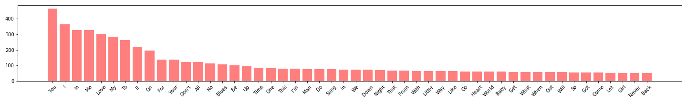
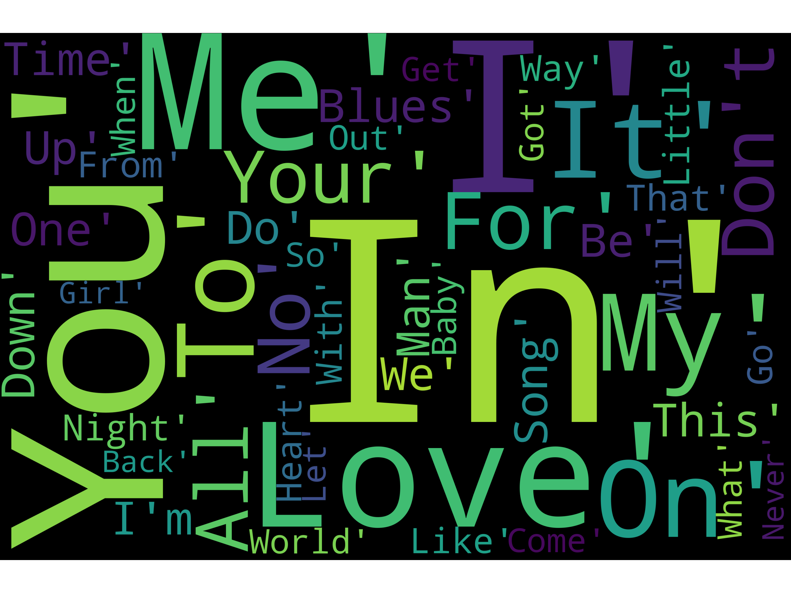
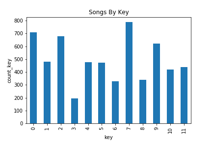
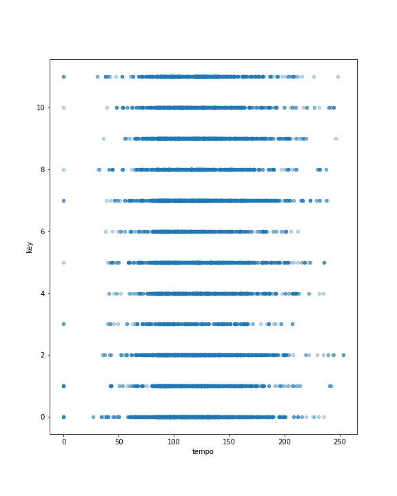
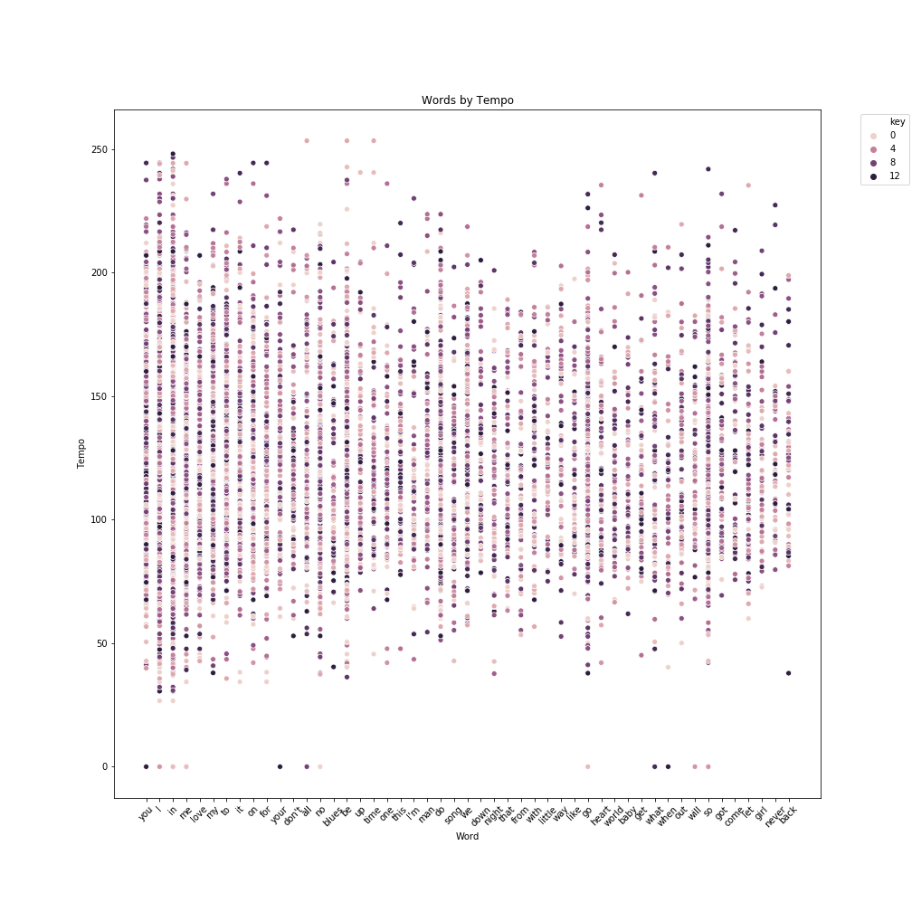

# Data as Art

## Table of Contents
* [Objective](#Objective)
* [Technologies](#Technologies)
* [ETL](#ETL)
* [Visualization](#Visualization)
* [Troubleshooting](#Troubleshooting)

# Objective | Create a Database Utilizing ETL on Music Dataset
Research and download large music dataset. Determine the most common words within the titles. Create a visual representation of the resilts.

The final production table uses a 10,000 song subset of the Million Song Database. (music.csv)

# Technologies
* Pandas
* Seaborn
* Matplotlib
* Python3
* PostgreSQL
* WordCloud

# ETL
## Process Documentation

The dataset was originally obtained fron Kaggle at the following link:

* [Top Spotify Songs 2010-2019](https://www.kaggle.com/leonardopena/top-spotify-songs-from-20102019-by-year)

However, after processing, I did not have enough data to achieve the results I was looking for. So I found an alternate dataset via the Million Song Dataset at the following link:

* [Million Song Dataset](https://labrosa.ee.columbia.edu/millionsong/)

## E | Extract
* Downloaded CSV dataset
* Read in CSV data in a Jupyter notebook file with Pandas
       
       '''
      file = 'Song-Classification/music.csv'
      df = pd.read_csv(file, encoding="ISO-8859-1")
       '''
## T | Transform

 
   Limited the dataset to only include entries with a *title*
      
       '''
       song_df=grammy_df[grammy_df['category'].str.contains('Song')]
       '''
   
   Delete extraneous columns
      
       '''
       del df['artist_mbtags']
       del df['familiarity']
       del df['similarity']
       del df['song.hotttnesss']
       df.head()
       '''
   
   Rename columns for functionality
   
      '''
      df = df.rename(columns={'artist.name': 'artist_name', 'song.id': 'song_id', 'artist.hotttnesss':'artist_hotttnesss'})
      '''
      
   Drop all rows with missing information
   
      '''
      df = df.dropna(how='any')
      '''
      
   Export file as a CSV, without the Pandas index, but with the header

      '''
      df.to_csv("music_cleaned.csv", index=False, header=True)
      '''
      
  
## L | Load

I decided to work in PostgreSQL due to the relational structure of our datasets. 

The final production table contains metadata from the Million Song Dataset subset (9,999 songs)

I used SQLAlchemy to query the information and return results for the number of songs that contain the words *[summer](results/summer.csv), [muse](results/muse.csv), [romance](results/romance.csv), or [birth](results/birth.csv).*

This led me to the question of "What are the most common words in song titles?"  To determine this, I continued to query in SCLAlchemy to determine the 50 most common words in song titles. This led me to further question whether tempo and song key may have any correlations.

### Steps: Tables/Collections

Created Songs table and added required columns

Imported the music_cleaned.csv 

Created query to discover the 50 most common words in the song titles using splits and unions, which was a challenge because some titles were up to 30 words long.

I then created a query to select all metadata for songs containing the 50 most common words. and exported it to a csv.

# Visualization

Using the new dataset, I created multiple visualizations.

       (where 0-C, 1-C#/Db, 2-D, 3-D#/Eb, 4-E, 5-F, 6-F#/Gb, 7-G, 8-Ab/G#, 9-A, 10-A#/Bb, 11-B)

# Troubleshooting

* Started with ambition to work with API's - Spotify, Apple Music, and Youtube 
* Changed course to work with Million Song Dataset, but the dataset was in db format and I was unable to convert it.
* Ultimately used existing csv data for the purpose of the project
* While working with API's the main challenges were working with all the necessary components and downloading all the suggested packages I was unfamiliar with using.

